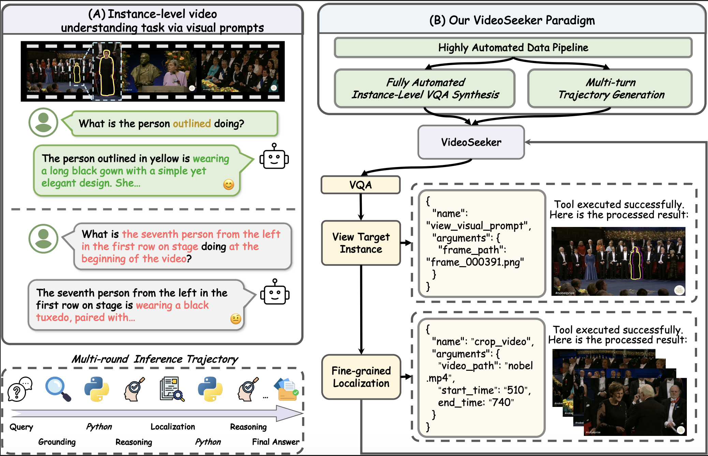
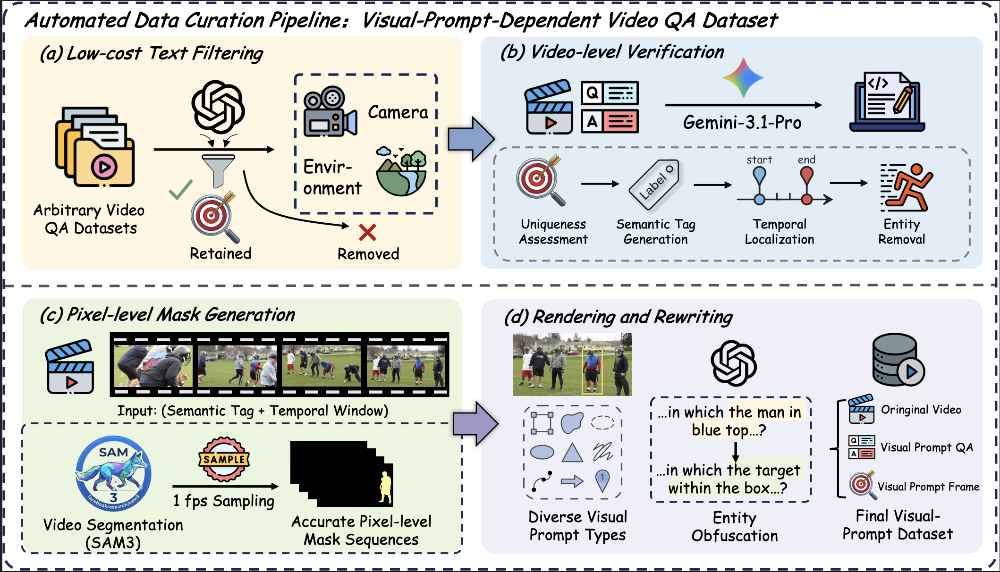
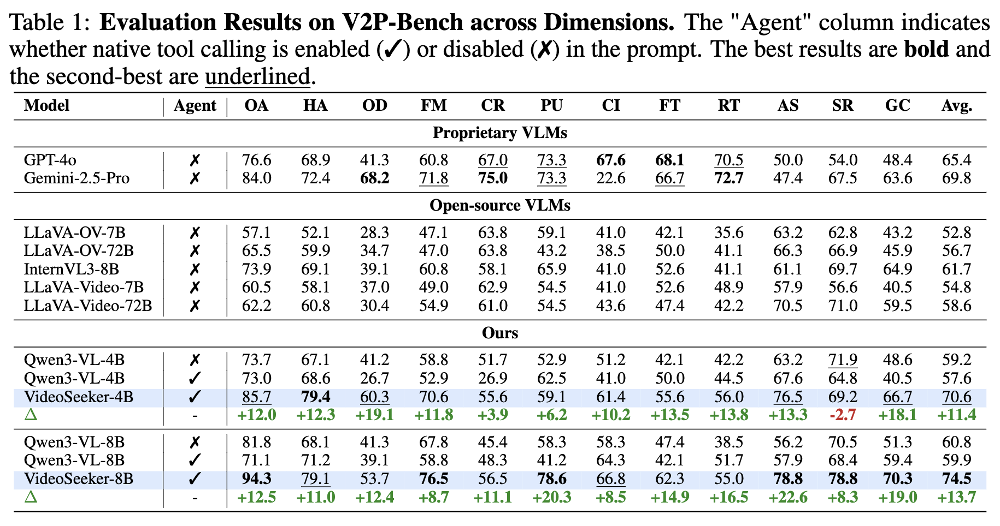

# VideoSeeker: Incentivizing Instance-level Video Understanding via Native Agentic Tool Invocation

<p align="center">
  <a href="https://img.shields.io/badge/License-Apache%202.0-green.svg">
    
  </a>
  <a href="https://img.shields.io/badge/Python-3.12-3776AB?logo=python&logoColor=FFD43B">
    
  </a>
  <a href="https://img.shields.io/badge/Cite-VideoSeeker-orange?logo=readme&logoColor=white">
    
  </a>
</p>

<font size=7><div align='center' > [[🌐 Homepage](https://gaotiexinqu.github.io/VideoSeeker/)] [[📖 arXiv Paper]()] [[📊 Code](https://github.com/gaotiexinqu/VideoSeeker)]  </div></font>

> VideoSeeker is a novel agentic instance-level video understanding paradigm via native tool invocation with visual prompts.

## News

* **[2026/05/14]** 🔥 We have released `VideoSeeker`, a novel agentic instance-level video understanding paradigm via visual prompts.

### Teaser

<p align="center">
    
</p>

### Data Pipeline
<p align="center">
    
</p>

### Performance

<p align="center">
    
</p>

# Quickstart

## Environmental Setup

### SFT
```
git clone https://github.com/gaotiexinqu/VideoSeeker

conda create -n llamafactory python=3.12
conda activate LLaMA-Factory
cd VideoSeeker/LLaMA-Factory/LLaMA-Factory
pip install -e .
```

### RL
```
conda create -n verl python=3.12
conda activate verl
cd VideoSeeker/verl/verl
bash scripts/install.sh
```

## Prepare Dataset

### SFT

### RL

### Eval

## Start Training

### SFT

### RL

## Evaluation

We support multi-benchmark parallel inference and evaluation on various video understanding benchmarks.

### 1. Inference

Configure your model and data paths in `benchmarks.json`:

```json
{
  "name": "V2P-Bench",
  "root": "/path/to/V2P-Bench",
  "frames_root": "$ROOT/frames",
  "videos_root": "$ROOT/videos",
  "dataset_info_path": "$ROOT/dataset_info_1148.json",
  "media_root": "$ROOT/videos",
  "tools": "view_visual_prompt",
  "mode": "tool"
}
```

Key configuration options:
- `root`: Base path for the dataset
- `tools`: Tool type (`view_visual_prompt` or `crop_video`)
- `mode`: Inference mode (`direct`, `reasoning`, or `tool`)
- `$ROOT` will be automatically replaced with the `root` value

```bash
# Set your checkpoint path in run_multi_inference.sh
CKPT_PATH="/path/to/your/model"

# Run multi-benchmark inference
bash eval/inference/run_multi_inference.sh
```

### 2. Evaluation

```bash
# Calculate metrics for all benchmarks
bash eval/calu_metrics/start_all_eval.sh

# Run LLM-as-judge evaluation for LongVT benchmarks
bash eval/calu_metrics/longvt/start_judge.sh
```

## Citation

```
@article{zhao2026videoseeker,
  title={VideoSeeker: Incentivizing Instance-level Video Understanding via Native Agentic Tool Invocation},
  author={Yiming Zhao and Yu Zeng and Wenxuan Huang and Zhen Fang and Qing Miao and Qisheng Su and Jiawei Zhao and Jiayin Cai and Lin Chen and Zehui Chen and Yukun Qi and Yao Hu and Xiaolong Jiang and Feng Zhao},
  journal={arXiv preprint arXiv:2605.xxxxx},
  year={2026}
}
```